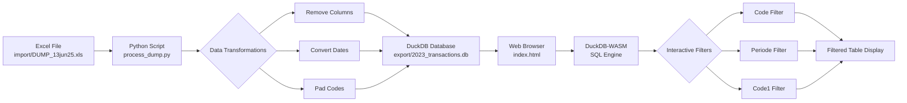

# DuckDB-WASM Viewer

A web-based data viewer that converts Excel files to DuckDB format and provides interactive filtering and visualization using DuckDB-WASM.

## Overview

This project provides a simple workflow for:
1. Converting Excel (.xls) files to optimized DuckDB database with data transformations
2. Viewing and filtering the data in a web browser using DuckDB-WASM
3. Interactive filtering by multiple dimensions (Code, Periode, Code1)



## Features

- **Data Transformation**: Python script to convert Excel to DuckDB with:
  - Column removal (removes unnecessary columns)
  - Date conversion (millisecond timestamps to proper datetime)
  - Code padding (CodeGrootboekrekening padded to 4 digits)

- **Web Viewer**: Browser-based interface with:
  - Drag-and-drop DuckDB database file loading
  - Three filter dropdowns (Code, Periode, Code1) that work together
  - Account rollup feature - aggregate transactions by account with total balances
  - Formatted display (dates as dd/mm/yyyy, numbers with thousand separators)
  - Right-aligned currency values
  - Small table font (10px) for dense data viewing

## Requirements

### Python Environment
- Python 3.12+
- uv (Python package manager)
- pandas 3.0
- duckdb
- openpyxl
- xlrd

### Web Viewer
- Modern web browser with WebAssembly support
- No server required - runs entirely in the browser

## Installation

1. Create and activate Python virtual environment:
```bash
uv venv
source .venv/bin/activate  # On macOS/Linux
```

2. Install Python dependencies:
```bash
uv pip install pandas>=3.0 duckdb openpyxl xlrd
```

## Usage

### Data Preparation

1. Place your Excel file in the `import/` directory:
```
import/DUMP_13jun25.xls
```

2. Run the conversion script:
```bash
python process_dump.py
```

This will:
- Read the Excel file
- Remove columns: Btwbedrag, Boekingsstatus, CodeAdministratie, Code2, Debet, Credit, Btwcode, Nummer
- Convert Boekdatum to datetime format
- Pad CodeGrootboekrekening to 4 digits with leading zeros
- Save the result to `export/2023_transactions.db`

### Viewing Data

1. Open `index.html` in a web browser

2. Click "Choose File" and select the DuckDB database file from the `export/` directory

3. Use the filter dropdowns to explore the data:
   - **Select Code**: Filter by transaction code
   - **Select Periode**: Filter by period
   - **Select Code1**: Filter by Code1 value
   - **Show All**: Clear all filters and show all records
   - **Rollup Accounts**: Aggregate transactions by account, showing totals per account

Filters can be combined - selecting multiple filters will show only records that match all criteria (AND logic). The Rollup Accounts feature respects active filters, allowing you to see account totals for filtered data.

## Project Structure

```
duck_ui5/
├── index.html              # Main web viewer interface
├── styles.css              # Styling for the web interface
├── process_dump.py         # Python data transformation script
├── transform_trial_balances.py # Trial balance transformation script
├── fac_TrialBalances.m     # Reference Power Query logic
├── package.json           # Node.js package configuration
├── LICENSE.md             # MIT License
├── .gitignore             # Git ignore rules
├── README.md              # Project documentation
├── import/                # Place source Excel files here (gitignored)
├── export/                # Generated DuckDB files (gitignored)
└── .venv/                 # Python virtual environment (gitignored)
```

## Trial Balance Transformation

Transform Excel trial balance exports to DuckDB using `transform_trial_balances.py`.

### Usage

```bash
uv run python transform_trial_balances.py
```

### Input

- `import/2025_BalansenWinstverliesperperiode.xlsx` - Trial balance with monthly columns

### Output

- `export/trial_balances.duckdb` - DuckDB database with `fct_TrialBalances` table

### Transformation Logic

The script replicates the Power Query logic from `fac_TrialBalances.m`:

1. **Unpivot** monthly columns (Openingsbalans, januari-december) to long format
2. **Map columns**:
   - `CodeDimensietype` → `Code0` (BAS/PNL)
   - `CodeRapportagestructuurgroep1` → `Code1` (account category)
3. **Calculate DisplayValue** with sign correction:
   - Activa (000-050): positive
   - Passiva (060-080): negative
   - Gross Margin (500-510): negative
   - Expenses (520-550): negative
4. **Generate profit rows** (synthetic account 9999) per period

## Data Transformations

The `process_dump.py` script performs the following transformations:

| Column | Transformation |
|--------|---------------|
| Boekdatum | Converted from millisecond timestamp to datetime64 |
| CodeGrootboekrekening | Padded to 4 digits with leading zeros |
| Saldo | Kept as float64 for calculations |
| Deleted columns | Btwbedrag, Boekingsstatus, CodeAdministratie, Code2, Debet, Credit, Btwcode, Nummer |

## Display Formatting

The web viewer applies the following display formatting:

- **Dates (Boekdatum)**: dd/mm/yyyy format
- **Currency (Saldo)**: Thousand separator, 2 decimal places, right-aligned
- **Codes**: Already padded in the data

## Technical Details

- **DuckDB-WASM**: In-browser SQL engine for querying DuckDB databases
- **DuckDB Format**: Embedded analytical database for efficient querying
- **Pandas 3.0**: Latest version for data transformation
- **No Backend Required**: Everything runs client-side

## Browser Compatibility

Works in modern browsers that support:
- WebAssembly
- ES6 Modules
- FileReader API

Tested on:
- Chrome/Edge (Chromium)
- Firefox
- Safari

## License

This project is licensed under the MIT License - see the [LICENSE.md](LICENSE.md) file for details.
