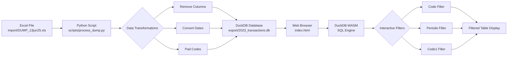

# DuckDB-WASM Viewer


A web-based data viewer that converts Excel files to DuckDB format and provides interactive filtering and visualization using DuckDB-WASM.

## Overview

This project provides a simple workflow for:
1. Converting Excel (.xls) files to optimized DuckDB database with data transformations
2. Viewing and filtering the data in a web browser using DuckDB-WASM
3. Interactive filtering by multiple dimensions (Code, Periode, Code1)



## Features

- **Data Transformation**: Python script to convert Excel to DuckDB with:
  - Column removal (removes unnecessary columns)
  - Date conversion (millisecond timestamps to proper datetime)
  - Code padding (CodeGrootboekrekening padded to 4 digits)

- **Web Viewer**: Browser-based interface with:
  - Drag-and-drop DuckDB database file loading
  - Three filter dropdowns (Code, Periode, Code1) that work together
  - Multiple rollup features:
    - Rollup Accounts - aggregate by account with total balances
    - Rollup by Code - aggregate by transaction code
    - Rollup by Periode - aggregate by period
  - Formatted display (dates as dd/mm/yyyy, numbers with thousand separators)
  - Right-aligned currency values
  - Small table font (10px) for dense data viewing

## Requirements

### Python Environment
- Python 3.12+
- uv (Python package manager)
- pandas 3.0
- duckdb
- openpyxl
- xlrd

### Web Viewer
- Modern web browser with WebAssembly support
- No server required - runs entirely in the browser

## Installation

1. Create and activate Python virtual environment:
```bash
uv venv
source .venv/bin/activate  # On macOS/Linux
```

2. Install Python dependencies:
```bash
uv pip install pandas>=3.0 duckdb openpyxl xlrd
```

## Usage

### Data Preparation

1. Place your Excel file in the `import/` directory:
```
import/DUMP_13jun25.xls
```

2. Run the conversion script:
```bash
python scripts/process_dump.py
```

This will:
- Read the Excel file
- Remove columns: Btwbedrag, Boekingsstatus, CodeAdministratie, Code2, Debet, Credit, Btwcode, Nummer
- Convert Boekdatum to datetime format
- Pad CodeGrootboekrekening to 4 digits with leading zeros
- Save the result to `export/2023_transactions.db`

### Viewing Data

1. Open `index.html` in a web browser

2. Click "Choose File" and select a DuckDB database file from the `export/` directory:
   - `2023_transactions.db` - Transaction data only
   - `trial_balances.duckdb` - Trial balance data only
   - `combined.db` - Both datasets in one file (recommended for schema analysis)

3. Use the filter dropdowns and rollup buttons to explore the data:
   - **Select Code**: Filter by transaction code
   - **Select Periode**: Filter by period
   - **Select Code1**: Filter by Code1 value
   - **Show All**: Clear all filters and show all records
   - **Rollup Accounts**: Aggregate transactions by account, showing totals per account
   - **Rollup by Code**: Aggregate transactions by Code, showing totals per code
   - **Rollup by Periode**: Aggregate transactions by Periode, showing totals per period

4. Click the **Schema** tab to view an entity-relationship diagram showing:
   - All tables in the database with their columns and data types
   - Relationships between tables (detected by matching column names)
   - Database statistics (table count, row count, relationships)

Filters can be combined - selecting multiple filters will show only records that match all criteria (AND logic). All rollup features respect active filters, allowing you to see aggregated totals for filtered data.

## Project Structure

```
duck_ui5/
├── index.html              # Main web viewer interface
├── styles.css              # Styling for the web interface
├── scripts/                # Python transformation scripts
│   ├── utils.py            # Shared utility functions
│   ├── process_dump.py     # Transaction data transformation
│   ├── transform_trial_balances.py # Trial balance transformation
│   ├── combine_databases.py # Combine multiple databases
│   ├── validate_account_codes.py # Validate data consistency
│   └── main.py             # Entry point (if needed)
├── m_code/                 # Power Query reference code
│   └── fac_TrialBalances.m # Reference Power Query logic
├── package.json           # Node.js package configuration
├── LICENSE.md             # MIT License
├── .gitignore             # Git ignore rules
├── README.md              # Project documentation
├── import/                # Place source Excel files here (gitignored)
├── export/                # Generated DuckDB files (gitignored)
└── .venv/                 # Python virtual environment (gitignored)
```

## Trial Balance Transformation

Transform Excel trial balance exports to DuckDB using `scripts/transform_trial_balances.py`.

### Usage

```bash
uv run python scripts/transform_trial_balances.py
```

### Input

- `import/2025_BalansenWinstverliesperperiode.xlsx` - Trial balance with monthly columns

### Output

- `export/trial_balances.duckdb` - DuckDB database with `fct_TrialBalances` table

### Transformation Logic

The script replicates the Power Query logic from `fac_TrialBalances.m`:

1. **Unpivot** monthly columns (Openingsbalans, januari-december) to long format
2. **Map columns**:
   - `CodeDimensietype` → `Code0` (BAS/PNL)
   - `CodeRapportagestructuurgroep1` → `Code1` (account category)
3. **Calculate DisplayValue** with sign correction:
   - Activa (000-050): positive
   - Passiva (060-080): negative
   - Gross Margin (500-510): negative
   - Expenses (520-550): negative
4. **Generate profit rows** (synthetic account 9999) per period
5. **Pad CodeGrootboekrekening** to 4 digits with leading zeros (using shared utility)

## Combining Databases

Combine multiple DuckDB databases into a single file using `scripts/combine_databases.py`.

### Usage

```bash
python scripts/combine_databases.py
```

### What It Does

Merges the following databases into `export/combined.db`:
- `export/2023_transactions.db` → `transactions` table
- `export/trial_balances.duckdb` → `fct_TrialBalances` table

**Also creates:**
- `vw_UniqueAccountCodes` view - List of all unique account codes from trial balances

This allows you to:
- Load both datasets in the web viewer simultaneously
- Query across both tables using SQL joins
- View the complete schema in the Schema page showing both tables and their relationships
- Access a ready-made view of unique account codes

### When to Use

Combine databases when you need to:
- Analyze transactions alongside trial balances
- View the full data model in one place
- Simplify file management (one file instead of multiple)

## Shared Utilities

The `scripts/utils.py` module contains shared functions used across multiple transformation scripts:

### `pad_account_code(code_series)`

Pads CodeGrootboekrekening (account codes) to 4 digits with leading zeros.

**Padding rules:**
- 2 characters → pad with 2 zeros (e.g., "10" → "0010")
- 3 characters → pad with 1 zero (e.g., "100" → "0100")
- 4 characters → no change (e.g., "1000" → "1000")

**Used by:**
- `process_dump.py` - Pads transaction account codes
- `transform_trial_balances.py` - Pads trial balance account codes

This ensures consistent account code formatting across all datasets.

## Database Views

The transformation scripts automatically create useful views in the DuckDB databases:

### `vw_UniqueAccountCodes`

**Purpose:** Provides a deduplicated list of all account codes from the trial balances.

**Definition:**
```sql
CREATE VIEW vw_UniqueAccountCodes AS
SELECT DISTINCT CodeGrootboekrekening
FROM fct_TrialBalances
ORDER BY CodeGrootboekrekening;
```

**Created by:**
- `transform_trial_balances.py` - In `export/trial_balances.duckdb`
- `combine_databases.py` - In `export/combined.db`

**Usage:**
```sql
-- Get all unique account codes
SELECT * FROM vw_UniqueAccountCodes;

-- Count unique codes
SELECT COUNT(*) FROM vw_UniqueAccountCodes;

-- Find codes starting with '08'
SELECT * FROM vw_UniqueAccountCodes WHERE CodeGrootboekrekening LIKE '08%';
```

**Example output:**
```
CodeGrootboekrekening
---------------------
0080
0081
0210
0211
0220
...
(227 unique codes)
```

**Use cases:**
- Chart of accounts reference
- Account code validation
- Reporting and analysis queries
- Data quality checks

## Data Validation

### Validate Account Code Consistency

The `scripts/validate_account_codes.py` script validates that all account codes in transactions exist in the trial balances chart of accounts.

**Usage:**
```bash
# Using Python directly
python scripts/validate_account_codes.py

# Or via Makefile
make validate

# Or via CLI (after pip install -e .)
validate-account-codes
```

**Command-line options:**
```bash
# Use custom file paths
python scripts/validate_account_codes.py \
  --transactions import/DUMP_13jun25.xls \
  --trial-balances import/2025_BalansenWinstverliesperperiode.xlsx

# Strict mode (exit with error code if validation fails)
python scripts/validate_account_codes.py --strict
```

**Output format:**
```
================================================================================
ACCOUNT CODE VALIDATION REPORT
================================================================================

📊 SUMMARY
--------------------------------------------------------------------------------
Transaction codes:      215 unique codes
Trial balance codes:    427 unique codes
Codes in both:          215 codes
Coverage:              100.0%

🔍 VALIDATION RESULTS
--------------------------------------------------------------------------------
✅ VALIDATION PASSED: All transaction codes exist in trial balances

ℹ️  INFO: 212 codes exist only in trial balances (not used in transactions)
--------------------------------------------------------------------------------
  - 0100
  - 0101
  ... (showing first 20)

✓ SAMPLE OF MATCHING CODES (showing 10 of 215):
--------------------------------------------------------------------------------
  - 0080
  - 0081
  - 0210
  ... (showing first 10)

================================================================================
```

**Validation checks:**
- ✅ All transaction account codes exist in trial balances (required)
- ℹ️  Extra codes in trial balances only (informational, not an error)
- 📊 Coverage percentage
- 📋 List of missing codes (if any)

**When to use:**
- Before data analysis to ensure referential integrity
- After updating source files to verify consistency
- As part of CI/CD pipeline with `--strict` flag

## Data Transformations

The `scripts/process_dump.py` script performs the following transformations:

| Column | Transformation |
|--------|---------------|
| Boekdatum | Converted from millisecond timestamp to datetime64 |
| CodeGrootboekrekening | Padded to 4 digits with leading zeros |
| Saldo | Kept as float64 for calculations |
| Deleted columns | Btwbedrag, Boekingsstatus, CodeAdministratie, Code2, Debet, Credit, Btwcode, Nummer |

## Display Formatting

The web viewer applies the following display formatting:

- **Dates (Boekdatum)**: dd/mm/yyyy format
- **Currency (Saldo)**: Thousand separator, 2 decimal places, right-aligned
- **Codes**: Already padded in the data

## Technical Details

- **DuckDB-WASM**: In-browser SQL engine for querying DuckDB databases
- **DuckDB Format**: Embedded analytical database for efficient querying
- **Pandas 3.0**: Latest version for data transformation
- **No Backend Required**: Everything runs client-side

## Browser Compatibility

Works in modern browsers that support:
- WebAssembly
- ES6 Modules
- FileReader API

Tested on:
- Chrome/Edge (Chromium)
- Firefox
- Safari

## License

This project is licensed under the MIT License - see the [LICENSE.md](LICENSE.md) file for details.
