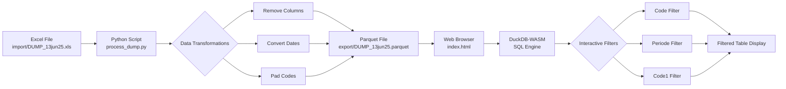

# DuckDB-WASM Parquet Viewer

A web-based data viewer that converts Excel files to Parquet format and provides interactive filtering and visualization using DuckDB-WASM.

## Overview

This project provides a simple workflow for:
1. Converting Excel (.xls) files to optimized Parquet format with data transformations
2. Viewing and filtering the data in a web browser using DuckDB-WASM
3. Interactive filtering by multiple dimensions (Code, Periode, Code1)



## Features

- **Data Transformation**: Python script to convert Excel to Parquet with:
  - Column removal (removes unnecessary columns)
  - Date conversion (millisecond timestamps to proper datetime)
  - Code padding (CodeGrootboekrekening padded to 4 digits)

- **Web Viewer**: Browser-based interface with:
  - Drag-and-drop Parquet file loading
  - Three filter dropdowns (Code, Periode, Code1) that work together
  - Formatted display (dates as dd/mm/yyyy, numbers with thousand separators)
  - Right-aligned currency values
  - Small table font (10px) for dense data viewing

## Requirements

### Python Environment
- Python 3.12+
- uv (Python package manager)
- pandas 3.0
- pyarrow
- openpyxl
- xlrd

### Web Viewer
- Modern web browser with WebAssembly support
- No server required - runs entirely in the browser

## Installation

1. Create and activate Python virtual environment:
```bash
uv venv
source .venv/bin/activate  # On macOS/Linux
```

2. Install Python dependencies:
```bash
uv pip install pandas>=3.0 pyarrow openpyxl xlrd
```

## Usage

### Data Preparation

1. Place your Excel file in the `import/` directory:
```
import/DUMP_13jun25.xls
```

2. Run the conversion script:
```bash
python process_dump.py
```

This will:
- Read the Excel file
- Remove columns: Btwbedrag, Boekingsstatus, CodeAdministratie, Code2, Debet, Credit, Btwcode, Nummer
- Convert Boekdatum to datetime format
- Pad CodeGrootboekrekening to 4 digits with leading zeros
- Save the result to `export/DUMP_13jun25.parquet`

### Viewing Data

1. Open `index.html` in a web browser

2. Click "Choose File" and select the Parquet file from the `export/` directory

3. Use the filter dropdowns to explore the data:
   - **Select Code**: Filter by transaction code
   - **Select Periode**: Filter by period
   - **Select Code1**: Filter by Code1 value
   - **Show All**: Clear all filters and show all records

Filters can be combined - selecting multiple filters will show only records that match all criteria (AND logic).

## Project Structure

```
duck_ui5/
├── index.html              # Main web viewer interface
├── styles.css              # Styling for the web interface
├── process_dump.py         # Python data transformation script
├── deno.json              # Deno configuration
├── main.ts                # TypeScript entry point
├── import/                # Place source Excel files here (gitignored)
├── export/                # Generated Parquet files (gitignored)
└── .venv/                 # Python virtual environment (gitignored)
```

## Data Transformations

The `process_dump.py` script performs the following transformations:

| Column | Transformation |
|--------|---------------|
| Boekdatum | Converted from millisecond timestamp to datetime64 |
| CodeGrootboekrekening | Padded to 4 digits with leading zeros |
| Saldo | Kept as float64 for calculations |
| Deleted columns | Btwbedrag, Boekingsstatus, CodeAdministratie, Code2, Debet, Credit, Btwcode, Nummer |

## Display Formatting

The web viewer applies the following display formatting:

- **Dates (Boekdatum)**: dd/mm/yyyy format
- **Currency (Saldo)**: Thousand separator, 2 decimal places, right-aligned
- **Codes**: Already padded in the data

## Technical Details

- **DuckDB-WASM**: In-browser SQL engine for querying Parquet files
- **Parquet Format**: Columnar storage format for efficient querying
- **Pandas 3.0**: Latest version for data transformation
- **No Backend Required**: Everything runs client-side

## Browser Compatibility

Works in modern browsers that support:
- WebAssembly
- ES6 Modules
- FileReader API

Tested on:
- Chrome/Edge (Chromium)
- Firefox
- Safari

## License

This project is for internal use.
